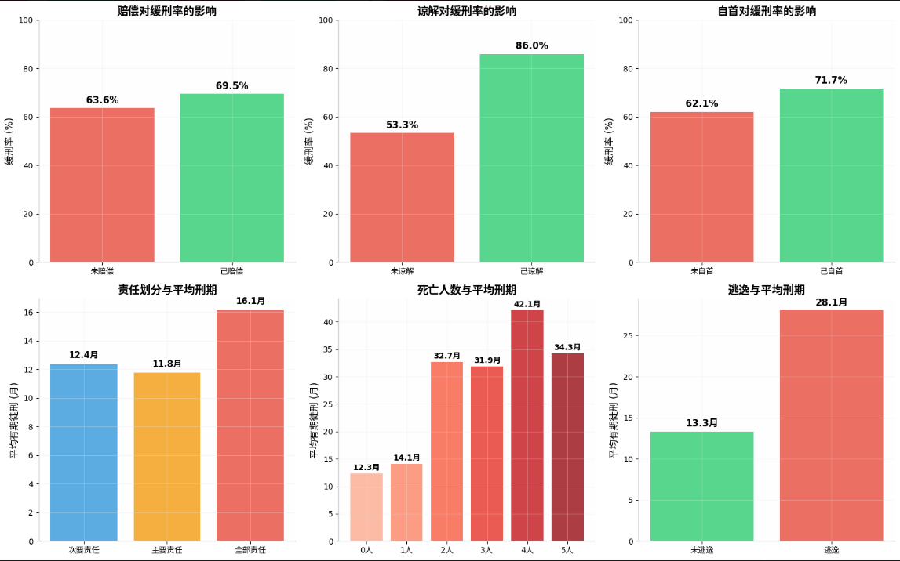
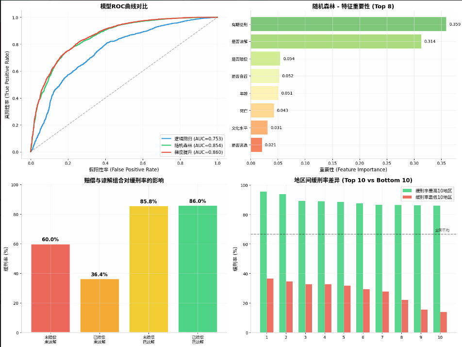

# traffic-crime-sentencing-analysis

基于23,000份交通肇事罪裁判文书的大数据挖掘与量刑量化分析。

## 📊 核心发现

| 发现 | 数据 |
|------|------|
| 取得谅解后缓刑率 | 86.0%（基线 53.3%） |
| 谅解的 OR 值 | 3.20（odds 增加 220%） |
| 逃逸使刑期增加 | 110%（13.3月 → 28.1月） |
| 地区缓刑率差异 | 81.7 个百分点（13.8% ~ 95.6%） |

## 🗂️ 数据集

- **规模**：23,028 份裁判文书
- **来源**：中国裁判文书网（2019年）
- **覆盖**：346 个地级市/自治州
- **字段**：被告人特征、事故情节、量刑结果等 23 个变量

## 🤖 模型方法

| 模型 | AUC | 用途 |
|------|-----|------|
| 逻辑回归 | 0.753 | 因果推断（OR 值） |
| 随机森林 | 0.854 | 特征重要性 |
| 梯度提升 | **0.860** | 最优预测 |

## 📈 可视化结果




## 🚀 快速开始

```bash
# 克隆仓库
git clone https://github.com/liukq666666-collab/traffic-crime-sentencing-analysis.git

# 安装依赖
pip install -r requirements.txt

# 运行分析
python analysis.py
